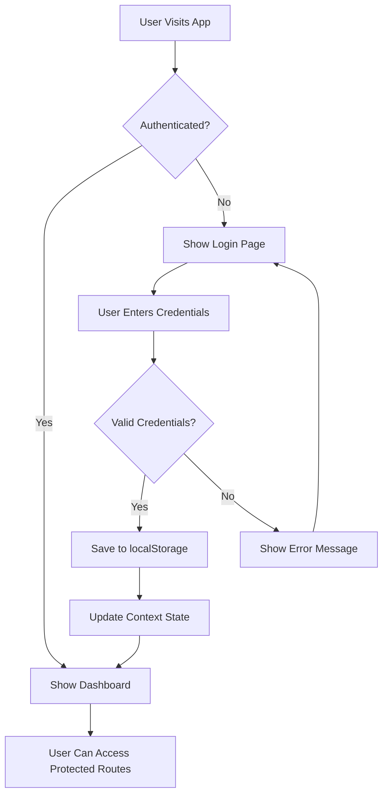

## � React Authentication App

A modern, full-featured React authentication application demonstrating best practices for user authentication, routing, and state management with Redux.

> **Note:** The `backupcode` directory in the repository root is not part of this project. It contains an older version that used Context API instead of Redux and is kept for reference only.🚀 React Authentication App

A modern, full-featured React authentication application demonstrating best practices for user authentication, routing, and state management.


## ✨ Features

- 🔐 **Complete Authentication System**
  - User login and signup
  - Persistent sessions with localStorage
  - Secure logout functionality
  - Mock API authentication

- 🛡️ **Protected Routes**
  - Route-based access control
  - Automatic redirects for unauthorized users
  - Loading states during authentication checks

- 🎨 **Modern UI/UX**
  - Responsive design with Tailwind CSS
  - Clean, professional interface
  - Mobile-friendly navigation
  - Loading spinners and transitions

- ⚡ **Performance Optimized**
  - React hooks with proper dependencies
  - Memoized functions with useCallback
  - Efficient re-renders
  - Code splitting ready

## 🏗️ Architecture

This project uses a modern feature-based architecture with Redux for state management:

```
src/
├── components/                   # Reusable UI components
│   ├── auth/
│   │   ├── AuthForm.jsx          # Universal login/signup form
│   │   └── ProtectedRoute.jsx    # Route protection wrapper
│   └── layout/
│       ├── Header.jsx            # Navigation header
│       └── Layout.jsx            # Main layout wrapper
├── features/                     # Redux features/slices
│   ├── auth/
│   │   └── authSlice.js          # Auth state management
│   └── form/
│       └── formSlice.js          # Form state management
├── hooks/
│   ├── useAuth.js                # Authentication hook
│   └── useForm.jsx               # Form handling with Redux
├── pages/
│   ├── auth/                     # Auth pages
│   │   ├── Login.jsx             # Login page
│   │   └── SignUp.jsx            # Registration page
│   ├── Dashboard.jsx             # Protected dashboard
│   ├── Home.jsx                  # Public home page
│   └── Profile.jsx               # User profile page
├── routes/
│   └── index.jsx                 # Route definitions
├── store/
│   └── index.js                  # Redux store configuration
│   ├── index.js                  # Route configuration
│   └── routeConfig.js            # Route settings
└── utils/                        # Utility functions
```

## 🚀 Quick Start

### Prerequisites
- Node.js 18+ 
- npm or yarn

### Installation

1. **Clone the repository**
   ```bash
   git clone <your-repo-url>
   cd my-project
   ```

2. **Install dependencies**
   ```bash
   npm install
   ```

3. **Start development server**
   ```bash
   npm run dev
   ```

4. **Open your browser**
   ```
   http://localhost:5173
   ```

### Demo Credentials
```
Email: user@example.com
Password: 123456
```

## 📱 Available Scripts

```bash
npm run dev          # Start development server
npm run build        # Build for production
npm run preview      # Preview production build
npm run lint         # Run ESLint
npm run lint:fix     # Fix ESLint errors
npm run format       # Format code with Prettier
npm run format:check # Check code formatting
```

## 🏗️ Architecture Explanation

The project follows a modern feature-based architecture with Redux for state management:

### Key Architecture Concepts:

1. **Feature-based Architecture:**
   - **Components:** Pure UI components with minimal business logic
   - **Features:** Redux slices organized by domain (Redux Toolkit recommended pattern)
   - **Pages:** Composition of components with routing logic
   - **Store:** Centralized Redux store configuration
   - **Hooks:** Reusable logic separated from UI

2. **Redux Organization:**
   - Following Redux Toolkit's recommended architecture
   - Feature folders contain domain-specific Redux slices
   - Store configuration centralizes slice integration

2. **State Management:**
   - Redux Toolkit for global state management
   - Slices organized by feature (auth, form)
   - Custom hooks for accessing state

3. **Folder Structure Benefits:**
   - Intuitive organization
   - Better collaboration
   - Easier maintenance
   - Scalable for larger applications

4. **Authentication Structure:**
   - Components in `/components/auth/` handle UI
   - State management in `/features/auth/`
   - Pages in `/pages/auth/` handle routing

## 🛠️ Built With

- **[React 19.1.0](https://reactjs.org/)** - UI library
- **[Vite 7.0.3](https://vitejs.dev/)** - Build tool
- **[React Router 7.6.3](https://reactrouter.com/)** - Client-side routing
- **[Tailwind CSS 4.1.11](https://tailwindcss.com/)** - Utility-first CSS
- **[ESLint](https://eslint.org/)** - Code linting
- **[Prettier](https://prettier.io/)** - Code formatting

## 🔐 Authentication Flow



## 📚 Key Components Explained

### AuthContext
Central authentication state management using React Context API:
- User state management
- Login/logout operations
- Persistent session handling
- Loading states

### Protected Routes
Route-level authentication checking:
- Automatic redirects for unauthenticated users
- Loading states during auth checks
- Seamless user experience

### Custom Hooks
Reusable authentication logic:
- `useAuth()` - Access authentication state
- `useForm()` - Handle form state and validation

## 🎯 Best Practices Implemented

- ✅ **Separation of Concerns** - Clear component responsibilities
- ✅ **Custom Hooks** - Reusable stateful logic
- ✅ **Error Boundaries** - Graceful error handling
- ✅ **Performance** - Memoized functions and optimized renders
- ✅ **Accessibility** - ARIA labels and keyboard navigation
- ✅ **Security** - XSS prevention and secure practices
- ✅ **Code Quality** - ESLint and Prettier configuration

## 🚀 Deployment

### Build for Production
```bash
npm run build
```

### Deploy to Vercel
```bash
npm install -g vercel
vercel --prod
```

### Deploy to Netlify
1. Connect your GitHub repository
2. Set build command: `npm run build`
3. Set publish directory: `dist`

## 🔮 Future Enhancements

- [ ] **Real API Integration**
  - Replace mock authentication
  - Add user registration API
  - Implement JWT token handling

- [ ] **Enhanced Security**
  - Password strength validation
  - Email verification
  - Two-factor authentication
  - Password reset functionality

- [ ] **User Experience**
  - Remember me functionality
  - Social login (Google, GitHub)
  - Profile picture upload
  - User preferences

- [ ] **Advanced Features**
  - Role-based permissions
  - User management dashboard
  - Activity logging
  - Multi-language support

## 🤝 Contributing

1. Fork the repository
2. Create a feature branch (`git checkout -b feature/amazing-feature`)
3. Commit your changes (`git commit -m 'Add amazing feature'`)
4. Push to the branch (`git push origin feature/amazing-feature`)
5. Open a Pull Request

## 📄 License

This project is licensed under the MIT License - see the [LICENSE](LICENSE) file for details.

## 🙏 Acknowledgments

- React team for the amazing framework
- Tailwind CSS for the utility-first approach
- Vite for the lightning-fast build tool
- Open source community for inspiration

---

**Built with ❤️ by [Your Name]**

For questions or support, please open an issue on GitHub.+ Vite

This template provides a minimal setup to get React working in Vite with HMR and some ESLint rules.

Currently, two official plugins are available:

- [@vitejs/plugin-react](https://github.com/vitejs/vite-plugin-react/blob/main/packages/plugin-react) uses [Babel](https://babeljs.io/) for Fast Refresh
- [@vitejs/plugin-react-swc](https://github.com/vitejs/vite-plugin-react/blob/main/packages/plugin-react-swc) uses [SWC](https://swc.rs/) for Fast Refresh

## Expanding the ESLint configuration

If you are developing a production application, we recommend using TypeScript with type-aware lint rules enabled. Check out the [TS template](https://github.com/vitejs/vite/tree/main/packages/create-vite/template-react-ts) for information on how to integrate TypeScript and [`typescript-eslint`](https://typescript-eslint.io) in your project.

src/
├── components/
│ ├── layout/
│ │ ├── Header.jsx # Common header with navigation
│ │ └── Layout.jsx # Main layout wrapper
│ ├── auth/
│ │ └── ProtectedRoute.jsx # Route protection component
│ └── index.js # Component exports
├── pages/
│ ├── Home.jsx # Landing page
│ ├── Login.jsx # Login page
│ ├── SignUp.jsx # Registration page
│ ├── Dashboard.jsx # Protected dashboard
│ └── Profile.jsx # Protected profile page
├── context/
│ └── AuthContext.jsx # Authentication context
├── hooks/ # Ready for custom hooks
├── utils/ # Ready for utility functions
└── App.jsx # Main app with routing
